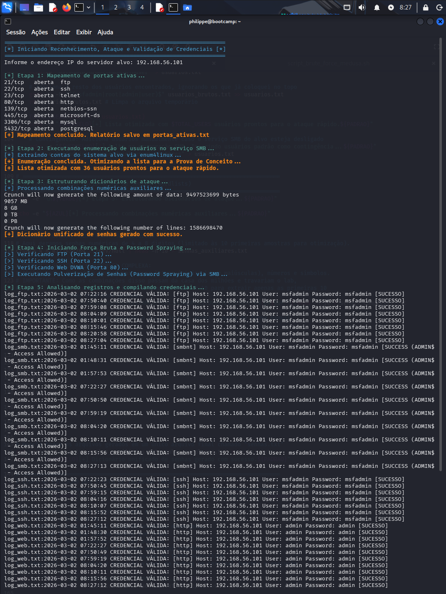
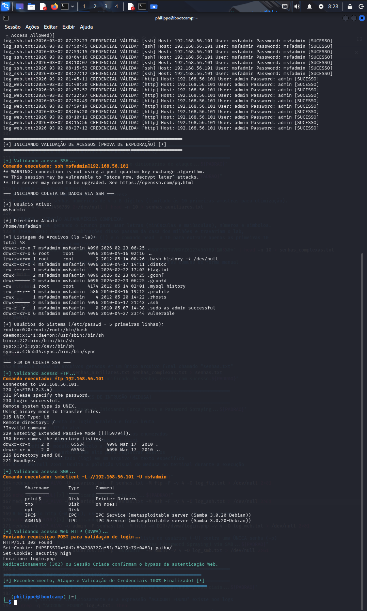

# 🛡️ Simulando um Ataque de Brute Force de Senhas com Medusa e Kali Linux

## 📌 Visão Geral do Projeto

Este repositório documenta a minha solução para o desafio prático de simulação de ataques de Força Bruta e *Password Spraying*, proposto no Bootcamp de Cibersegurança da Riachuelo em parceria com a DIO.

Em vez de executar ferramentas de forma isolada e manual, optei por elevar o nível técnico do desafio desenvolvendo um **Script de Automação em Bash (`script_brute_force_medusa.sh`)**. Este script orquestra todo o ciclo de vida de um teste de intrusão básico: desde o reconhecimento de rede (Information Gathering), passando pela criação inteligente de *wordlists*, até a exploração automatizada e a validação do acesso real via Pós-Exploração.

**⚠️ Aviso Legal:** Todo o código e arquitetura descritos aqui foram desenvolvidos e executados de forma ética em um ambiente de laboratório estritamente controlado e isolado (Rede Host-Only via VirtualBox).

---

## 🏗️ Arquitetura do Laboratório

* **Sistema Atacante:** Kali Linux (Rolling Release).
* **Sistema Alvo:** Metasploitable 2 (Vulnerável por design).
* **Isolamento:** Interface de rede Host-Only, impedindo vazamento de tráfego para a internet.

### 🛠️ Tecnologias e Ferramentas Empregadas

Consultei as documentações oficiais de cada ferramenta para parametrizar o script com a máxima eficiência:
* [**Nmap**](https://nmap.org/book/man.html): Para escaneamento de portas e descoberta de serviços.
* [**Enum4linux**](https://labs.portcullis.co.uk/tools/enum4linux/): Para extração de dados do protocolo SMB/Samba.
* [**Crunch**](https://sourceforge.net/projects/crunch-wordlist/): Para geração de dicionários numéricos e alfanuméricos complexos.
* [**Medusa**](http://foofus.net/goons/jmk/medusa/medusa.html): A ferramenta central de força bruta paralela e *password spraying*.
* **Bash & Utilitários GNU (`awk`, `grep`, `sed`):** Para o tratamento de dados (parsing), filtragem de logs e validação de acessos.

---

## ⚙️ O Fluxo de Execução e Inteligência do Script

O script foi modularizado em 6 etapas cruciais, detalhadas abaixo:

### Etapa 1: Reconhecimento Ativo
Iniciei a varredura com o **Nmap** (`nmap -p <portas> --open -T4`) para identificar os vetores de ataque. O relatório identificou serviços críticos expostos como FTP (21), SSH (22), HTTP/DVWA (80) e SMB (139/445).

### Etapa 2: Enumeração de Usuários
Para evitar ataques "cegos", utilizei o `enum4linux` visando o serviço SMB. O sistema retornou uma lista de 36 contas válidas. 
**🧠 Tática de Otimização:** O script não apenas extrai os usuários, mas aplica uma técnica de *Wordlist Profiling*, forçando usuários de alto valor (`msfadmin`, `root`, `admin`) para o topo da lista. Isso reduz o tempo de ataque drasticamente e evita alarmes.

### Etapa 3: Engenharia de Dicionários (Wordlists)
Para simular cenários reais, o dicionário foi compilado através da união de três fontes:
1.  Geração de senhas numéricas via **Crunch**.
2.  Geração de uma amostra de senhas alfanuméricas complexas (letras, números e símbolos).
3.  Uma base de senhas estáticas comuns e padrões de fábrica.

### Etapa 4: Exploração (Evasão e Eficiência)
A execução do **Medusa** foi parametrizada para evitar um ataque de Negação de Serviço (DoS) acidental, que comumente ocorre contra o serviço FTP (tarpitting).
* **Comandos utilizados:**
    * `medusa -h ALVO -U users -P senhas -M <modulo> -t 4 -T 3 -F`
* **A tática:**Implementei a flag de First Valid (`-F`) para interromper a varredura assim que encontrasse a primeira credencial válida. Com as credenciais corretas já no topo do dicionário (Etapa 2), o Medusa encontra a senha e interrompe o ataque imediatamente, burlando bloqueios temporários dos serviços.
* **Vetor SMB:** Em vez de Força Bruta, apliquei a técnica de *Password Spraying*, testando uma única senha padrão contra todos os 36 usuários enumerados.

### Etapa 5 e 6: Pós-Exploração Automatizada
O diferencial deste projeto. O script não apenas informa que a senha foi descoberta, mas aplica engenharia de extração (`awk` e `tail`) nos logs do Medusa. Ele pega essas credenciais no momento em que são validadas e usa ferramentas nativas (`sshpass`, `ftp`, `smbclient` e `curl`) para invadir o servidor e extrair as evidências do comprometimento sem intervenção humana.

---

## 📸 Evidências do Teste de Intrusão (PoC)

As imagens abaixo comprovam o funcionamento fluido do framework desenvolvido.

**1. Mapeamento, Enumeração e Exploração (Nmap, Crunch e Medusa)**

*Nesta captura, é possível observar o Nmap identificando as portas abertas, a lista de usuários sendo otimizada e o Medusa efetuando os acertos precisos (`[SUCESSO]`) nos módulos FTP, SSH, Web e SMB.*

**2. Validação e Pós-Exploração Automática (O Impacto)**

*A comprovação do comprometimento total. O script injetou comandos remotamente via SSH, exibindo os detalhes do usuário logado (`msfadmin`), diretório (`pwd`), permissões de arquivos (`ls -la`) e dados sensíveis (`/etc/passwd`). Além disso, listou os diretórios FTP, os compartilhamentos SMB e interceptou o redirecionamento HTTP (302) do DVWA.*

---

## 🛡️ Conclusões e Medidas de Mitigação

Este laboratório evidenciou como senhas fracas combinadas com a exposição indevida de serviços de administração podem levar ao comprometimento integral de um servidor (Root/Admin takeover) em questão de segundos.

Para defender infraestruturas contra os vetores automatizados demonstrados no script, recomendo a implementação das seguintes políticas de segurança (Blue Team):

1.  **Políticas de Bloqueio (Account Lockout) e Fail2Ban:** Implementar limites de tentativas falhas de login (ex: 5 tentativas) para mitigar a força bruta paralela e banir temporariamente IPs atacantes no Firewall.
2.  **Monitoramento e Alertas:** Monitorar os logs de segurança para detectar padrões de *Password Spraying*, que tentam contornar a regra de Account Lockout.
3.  **Múltiplos Fatores de Autenticação (MFA):** Essencial em painéis Web e serviços de acesso remoto (SSH). O MFA inviabiliza o ataque mesmo que o Medusa obtenha sucesso na quebra da senha.
4.  **Desativação de Protocolos Inseguros:** Substituir permanentemente o uso de FTP por SFTP e Telnet por SSH. Configurar o SSH para aceitar apenas autenticação via Chaves Públicas (Desabilitando o *PasswordAuthentication* no arquivo `sshd_config`).

---
*Documentação elaborada por Philippe Correia dos Santos Brito.*
